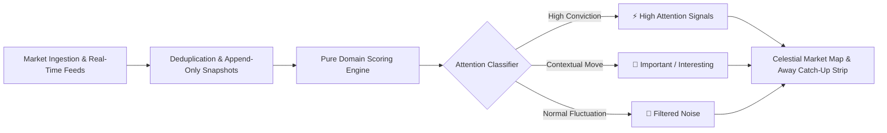

<div align="center">

# ⚡ PULSE

### *Your market, monitored for you.*

**An intelligent attention engine that transforms passive stock watchlists into proactive, signal-driven market intelligence.**

[](https://nextjs.org/)
[](https://react.dev/)
[](https://www.typescriptlang.org/)
[](https://www.prisma.io/)
[](https://tailwindcss.com/)
[](https://vitest.dev/)
[](https://github.com/swasray2004/Pulse)

---

</div>

## 💡 The Problem

Traditional brokerages and watchlist apps force investors into a passive, anxiety-inducing loop:
- **Alert Fatigue:** Users check watchlists 20+ times a day only to see random, normal market vibrations.
- **Lost Context:** When stepping away for hours or days, catching up requires manually cross-referencing price charts, volume logs, and news wires.
- **Zero Signal-to-Noise Ratio:** A 3% jump in a high-beta stock during an index rally is noise. A 1.8% climb on 4x volume against an earnings beat is a high-conviction signal.

---

## 🚀 The Solution: What is PULSE?

**PULSE** is a smart watchlist assistant. Instead of asking you to stare at flickering green and red numbers, PULSE analyzes your portfolio and surfaces:
1. **What changed** in your market.
2. **Why it matters** (transparent attribution).
3. **What actually deserves your attention** (ranked by an intelligent Attention Score).



---

## ✨ Key Features

### 1. 🪐 Celestial Physics Market Map
- Interactive, collision-relaxed celestial visualization of your watchlist.
- Spheres are gravitationally drawn to the core based on their **Attention Score** and rendered with realistic 3D lighting, rim glints, and animated pulse halos.
- Instant hover peek with contextual price trajectory and direct stock drill-down.

### 2. ⏳ "While You Were Away" Catch-Up Engine
- When you return after hours or days, PULSE tells you: *"You were away for 4h 37m. 23 movements occurred: 4 deserve attention, 19 filtered as noise."*
- Interactive visual event timeline chronologically ordering catalyst events, volume anomalies, and earnings reactions.
- One-click check-in to reset your market baseline.

### 3. 🎯 Multi-Factor Attention Score (0 – 100)
Every stock movement is mathematically graded across 6 orthogonal dimensions:
- **Price Velocity (0–30 pts):** Magnified moves normalized against volatility.
- **Volume Anomaly (0–20 pts):** Current volume vs. 20-day historical baseline ratio.
- **Relative Strength (0–20 pts):** Outperformance vs. benchmark index and sector peers.
- **Catalyst Corroboration (0–15 pts):** Corroborated with news, earnings beats, guidance revisions, or 52-week milestones.
- **Historical Volatility Dampener (0–10 pts):** Filters out expected chop in naturally volatile assets.
- **Personalized Weights (-10 to +10 pts):** Fine-tune sensitivity sliders to match your trading style.

### 4. ⏪ Time Travel Market Replay
- Scrub back and forth across market hours with an interactive scrubber.
- Watch how attention shifts across your watchlist as market sessions develop.

### 5. 🔍 Transparent Signal Attribution
- No black boxes. Every classification provides complete explainability:
  - Exact breakdown of which components generated the score.
  - Data freshness indicators (`LIVE`, `DELAYED`, or `STALE`).
  - Source tracking and discrepancy detection between data providers.

---

## 🏗️ Architecture & Engineering Highlights

```
pulse_groww/
├── src/
│   ├── app/                      # Next.js 16 App Router (React 19)
│   │   ├── api/                  # Secure REST API routes (Auth & Permissions enforced)
│   │   ├── away/                 # While You Were Away catch-up page
│   │   ├── preferences/          # User sensitivity configuration
│   │   ├── replay/               # Historical market scrubber
│   │   ├── stock/[symbol]/       # Deep-dive stock inspection & signal breakdown
│   │   └── watchlist/            # Multi-watchlist management
│   ├── components/               # Glassmorphic UI & Canvas/SVG components
│   │   ├── MarketMap.tsx         # Physics-relaxed 3D celestial canvas
│   │   ├── AttentionCard.tsx     # Signal cards with micro-animations
│   │   └── NumberMorph.tsx       # Smooth spring-physics metric transitions
│   ├── domain/                   # Pure Domain Logic (0 external I/O, 100% test coverage)
│   │   ├── attention-score.ts    # Mathematical scoring engine
│   │   ├── change-detection.ts   # Absence summarizer & event deduplication
│   │   ├── state-classifier.ts   # Market state machine
│   │   └── market-data-resolver.ts # Conflict resolution & freshness guards
│   └── lib/                      # Infrastructure, database pool, & external clients
│       ├── prisma.ts             # Connection-pooled PostgreSQL singleton
│       ├── auth.ts               # Iron-session encrypted cookie handlers
│       └── market-data/          # External provider adapters with resilient fallback
└── prisma/
    ├── schema.prisma             # PostgreSQL data model
    └── seed-demo.mjs             # Zero-dependency demo market snapshot seeder
```

### 🛡️ Production & Security Best Practices
- **Session Security:** State-of-the-art encrypted session cookies using `iron-session` with `httpOnly`, `secure`, and `sameSite: "lax"`.
- **Credential Protection:** Passwords securely hashed with salted `bcryptjs`.
- **Strict Authorization:** Multi-tenant isolation ensuring users can only read, analyze, and mutate their own watchlists and preferences.
- **Enterprise Security Headers:** Configured with `X-Frame-Options: DENY`, `X-Content-Type-Options: nosniff`, `Referrer-Policy`, and modern strict transport headers.
- **Graceful Fault Tolerance:** External market provider outages, rate limits (HTTP 429), or missing API keys automatically fall back to historical snapshots marked as `isStale: true` — **never crashing, never fabricating fake data**.
- **DB Connection Resiliency:** Custom connection pool limiter configured for high concurrency and zero leak operations.

---

## ⚡ Quick Start

### Prerequisites
- [Node.js](https://nodejs.org/) (v20+ recommended)
- [npm](https://www.npmjs.com/) or [pnpm](https://pnpm.io/)

### 1. Clone & Install
```bash
git clone https://github.com/swasray2004/Pulse.git
cd Pulse
npm install
```

### 2. Configure Environment
Copy the sample environment file:
```bash
cp .env.example .env
```
*(Optionally provide `MARKET_DATA_API_KEY` for live Alpha Vantage market ingestion, or leave blank to run in offline sandbox mode).*

### 3. Seed Demo Market Data
Populate the database with demo market snapshots, price changes, and catalyst events:
```bash
npm run seed
```

### 4. Run Development Server
```bash
npm run dev
```
Open [http://localhost:3000](http://localhost:3000) in your browser.

---

## 🧪 Verification & Quality Assurance

PULSE is thoroughly tested and verified with zero compiler or linter errors:

```bash
# Run unit test suite (23 tests across scoring, change-detection, and data resolution)
npm test

# Run ESLint validation (0 errors, 0 warnings)
npm run lint

# Compile optimized production bundle
npm run build
```

---

## 👥 Authors & Acknowledgments

Built for the **Groww Hackathon**. Designed and developed with precision for modern investors.
