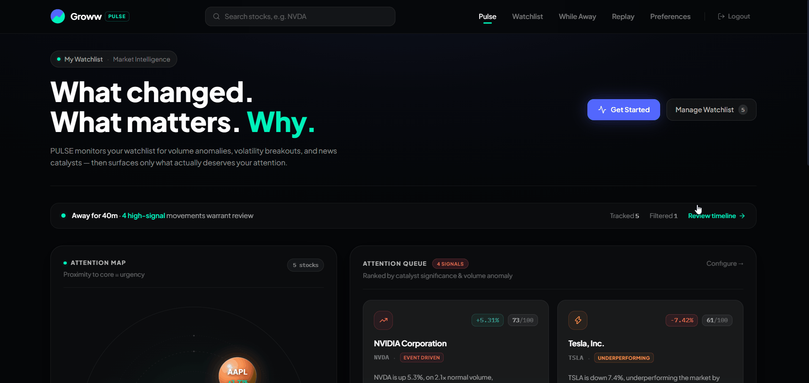
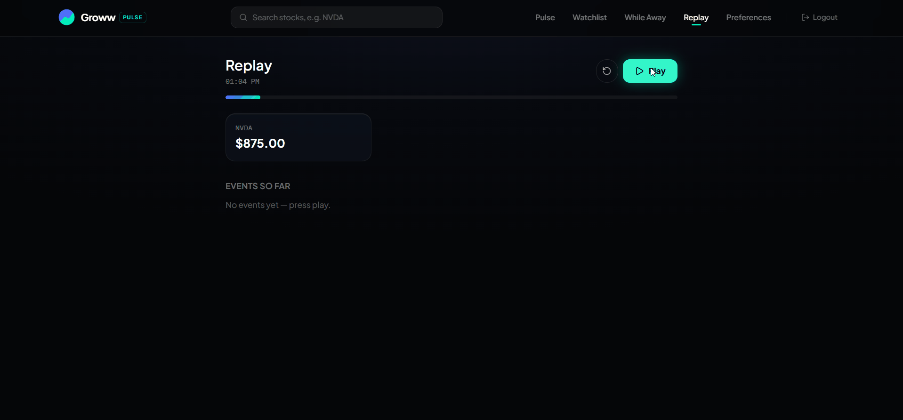

<div align="center">

# âš¡ PULSE

### *Your market, monitored for you.*

**An intelligent attention engine that transforms passive stock watchlists into proactive, signal-driven market intelligence.**

[](https://nextjs.org/)
[](https://react.dev/)
[](https://www.typescriptlang.org/)
[](https://www.prisma.io/)
[](https://tailwindcss.com/)
[](https://vitest.dev/)
[](https://github.com/swasray2004/Pulse)

---

</div>

## 🚀 Live Demo

### **Deployed URL → https://pulse-opal-ten.vercel.app/**

### **[💻 GitHub Repository →](https://github.com/swasray2004/Pulse)**


*Attention-ranked signals on the Pulse homepage, scored from your last visit.*

## 🎯 100-Word Product Pitch

PULSE is a smart market watchlist designed around one question: **what actually deserves my attention?** Instead of showing every price movement equally, PULSE establishes a personal baseline from the user's last visit, detects meaningful changes, and ranks them using transparent signals across price, volume, relative performance, catalysts, volatility, and preferences. I designed it as a modular monolith so the core decision logic remains pure and independently testable while the application stays simple to deploy. PostgreSQL provides persistent watchlists, snapshots, events, and visit state, while provider fallbacks prevent unreliable market APIs from breaking the experience. The result is a watchlist that explains **what changed, why it matters, and what to look at next.**

## 💡 The Problem

Traditional brokerages and watchlist apps force investors into a passive, anxiety-inducing loop:
- **Alert Fatigue:** Users check watchlists 20+ times a day only to see random, normal market vibrations.
- **Lost Context:** When stepping away for hours or days, catching up requires manually cross-referencing price charts, volume logs, and news wires.
- **Zero Signal-to-Noise Ratio:** A 3% jump in a high-beta stock during an index rally is noise. A 1.8% climb on 4x volume against an earnings beat is a high-conviction signal.

---

## 🚀 The Solution: What is PULSE?

**PULSE** is a smart watchlist assistant. Instead of asking you to stare at flickering green and red numbers, PULSE analyzes your portfolio and surfaces:
1. **What changed** in your market.
2. **Why it matters** (transparent attribution).
3. **What actually deserves your attention** (ranked by an intelligent Attention Score).

```mermaid
flowchart LR
    A[Market Ingestion & Real-Time Feeds] --> B[Deduplication & Append-Only Snapshots]
    B --> C[Pure Domain Scoring Engine]
    C --> D{Attention Classifier}
    D -->|High Conviction| E[âš¡ High Attention Signals]
    D -->|Contextual Move| F[🔶 Important / Interesting]
    D -->|Normal Fluctuation| G[🌱 Filtered Noise]
    E & F & G --> H[Celestial Market Map & Away Catch-Up Strip]
```



---

## 🧠 The Product Decision

Most watchlists answer:

> "What are the prices right now?"

PULSE answers:

> **"What meaningfully changed since I last looked, and what deserves my attention?"**

That distinction drives the entire product.

Instead of treating every price movement as equally important, PULSE:

- Establishes a baseline from the user's last visit
- Detects meaningful changes rather than simple movement
- Combines multiple signals into an Attention Score
- Explains why a movement matters
- Filters normal market noise
- Lets users replay how attention changed over time

The goal is not to show **more market information**.

The goal is to reduce the amount of information a user has to process.

---

## ✨ Key Features

### 1. 🪐 Celestial Physics Market Map
- Interactive, collision-relaxed celestial visualization of your watchlist.
- Spheres are gravitationally drawn to the core based on their **Attention Score** and rendered with realistic 3D lighting, rim glints, and animated pulse halos.
- Instant hover peek with contextual price trajectory and direct stock drill-down.

### 2. ⏳ "While You Were Away" Catch-Up Engine
- When you return after hours or days, PULSE calculates the real time since your last visit and summarizes how many movements occurred, which deserve attention, and which were filtered as noise.
- Interactive visual event timeline chronologically ordering catalyst events, volume anomalies, and earnings reactions.
- One-click check-in to reset your market baseline.


*Returning after hours away: real duration calculated from your last visit, movements ranked by attention score.*

### 3. 🎯 Multi-Factor Attention Score (0 – 100)
Every stock movement is mathematically graded across 6 orthogonal dimensions:
- **Price Velocity (0–30 pts):** Magnified moves normalized against volatility.
- **Volume Anomaly (0–20 pts):** Current volume vs. 20-day historical baseline ratio.
- **Relative Strength (0–20 pts):** Outperformance vs. benchmark index and sector peers.
- **Catalyst Corroboration (0–15 pts):** Corroborated with news, earnings beats, guidance revisions, or 52-week milestones.
- **Historical Volatility Dampener (0–10 pts):** Filters out expected chop in naturally volatile assets.
- **Personalized Weights (-10 to +10 pts):** Fine-tune sensitivity sliders to match your trading style.

### 4. ⏪ Time Travel Market Replay
- Scrub back and forth across market hours with an interactive scrubber.
- Watch how attention shifts across your watchlist as market sessions develop.


*Price Replay: scrub the observation timeline to see exactly how each symbol moved across the session.*

### 5. 🔍 Transparent Signal Attribution
- No black boxes. Every classification provides complete explainability:
  - Exact breakdown of which components generated the score.
  - Data freshness indicators (`LIVE`, `DELAYED`, or `STALE`).
  - Source tracking and discrepancy detection between data providers.

---

## 🛡️ Edge Cases & Resilience

PULSE is designed around failure and ambiguous data, not just the happy path.

| Scenario | Behaviour |
|---|---|
| First-time user | Establishes a baseline instead of inventing an "away" period |
| Empty watchlist | Shows an intentional empty state rather than failing |
| Missing market snapshots | Falls back to the latest available stored data |
| Stale provider data | Surfaces freshness state (`LIVE` / `DELAYED` / `STALE`) instead of presenting it as live |
| Provider outage / rate limit | Uses stored snapshots rather than breaking the experience |
| Conflicting market data | Applies reliability ranking and discrepancy detection before surfacing data |
| Long absence (3+ days) | Caps high-attention signals at 8 to prevent overwhelming the user |
| Duplicate events | Deduplicates events within a 10-minute time bucket |
| Concurrent check-ins | Uses persisted `UserVisit` state; visit timestamp is written only after scores are computed |
| Unauthorized watchlist access | Server derives the authenticated user from the session and enforces ownership on every query |

---

## 🏗️ Architecture & Engineering Highlights

```
pulse_groww/
├── src/
│   ├── app/                      # Next.js 16 App Router (React 19)
│   │   ├── api/                  # Secure REST API routes (Auth & Permissions enforced)
│   │   ├── away/                 # While You Were Away catch-up page
│   │   ├── preferences/          # User sensitivity configuration
│   │   ├── replay/               # Historical market scrubber
│   │   ├── stock/[symbol]/       # Deep-dive stock inspection & signal breakdown
│   │   └── watchlist/            # Multi-watchlist management
│   ├── components/               # Glassmorphic UI & Canvas/SVG components
│   │   ├── MarketMap.tsx         # Physics-relaxed 3D celestial canvas
│   │   ├── AttentionCard.tsx     # Signal cards with micro-animations
│   │   └── NumberMorph.tsx       # Smooth spring-physics metric transitions
│   ├── domain/                   # Pure Domain Logic (0 external I/O, 100% test coverage)
│   │   ├── attention-score.ts    # Mathematical scoring engine
│   │   ├── change-detection.ts   # Absence summarizer & event deduplication
│   │   ├── state-classifier.ts   # Market state machine
│   │   └── market-data-resolver.ts # Conflict resolution & freshness guards
│   └── lib/                      # Infrastructure, database pool, & external clients
│       ├── prisma.ts             # Connection-pooled PostgreSQL singleton
│       ├── auth.ts               # Iron-session encrypted cookie handlers
│       └── market-data/          # External provider adapters with resilient fallback
└── prisma/
    ├── schema.prisma             # PostgreSQL data model
    └── seed-demo.mjs             # Zero-dependency demo market snapshot seeder
```

### 🛡️ Production & Security Best Practices
- **Session Security:** State-of-the-art encrypted session cookies using `iron-session` with `httpOnly`, `secure`, and `sameSite: "lax"`.
- **Credential Protection:** Passwords securely hashed with salted `bcryptjs`.
- **Strict Authorization:** Multi-tenant isolation ensuring users can only read, analyze, and mutate their own watchlists and preferences.
- **Enterprise Security Headers:** Configured with `X-Frame-Options: DENY`, `X-Content-Type-Options: nosniff`, `Referrer-Policy`, and modern strict transport headers.
- **Graceful Fault Tolerance:** External market provider outages, rate limits (HTTP 429), or missing API keys automatically fall back to historical snapshots marked as `isStale: true` — **never crashing, never fabricating fake data**.
- **DB Connection Resiliency:** Custom connection pool limiter configured for high concurrency and zero leak operations.

---

## ⚖️ Key Engineering Trade-offs

### Modular monolith over microservices
PULSE keeps the application in one deployable unit while separating domain logic, infrastructure, API routes, and UI. This keeps deployment and debugging simple without coupling the scoring engine to the framework.

### Database-backed state over client state
Watchlists, market snapshots, events, preferences, and visit timestamps live in PostgreSQL so the user's baseline survives sessions and devices.

### Provider abstraction over provider coupling
Market data access is isolated behind provider adapters (`IMarketDataProvider`). This allows the application to change providers without touching the attention engine.

### Graceful fallback over fake freshness
When external market data is unavailable, PULSE uses the latest known snapshot and marks it `isStale: true` rather than fabricating current values.

### No unnecessary real-time infrastructure
The current product uses request-driven market ingestion rather than WebSockets. This keeps the architecture simple for the problem while leaving a clear path to real-time updates later.

### In-memory rate limiting
Rate limiting is intentionally lightweight for the current single-instance deployment. A distributed limiter (e.g. Redis) would be appropriate when running multiple application instances.

---

## 📈 Scalability

The current architecture is intentionally simple but has clear scaling boundaries:

- **Stateless application routes** allow additional application instances to be added horizontally.
- **PostgreSQL** provides durable shared state for users, watchlists, snapshots, events, and visits.
- **Connection pooling** prevents every request from creating an independent database connection.
- **Domain logic is isolated from I/O**, allowing scoring and change detection to scale independently if market processing becomes asynchronous.
- **Provider adapters** isolate external API rate limits and failures from the rest of the application.
- For significantly larger workloads, market ingestion can move to a background worker/queue and attention computation can be cached or materialized rather than calculated on every request.

---

## âš¡ Quick Start

### Prerequisites
- [Node.js](https://nodejs.org/) (v20+ recommended)
- [npm](https://www.npmjs.com/) or [pnpm](https://pnpm.io/)

### 1. Clone & Install
```bash
git clone https://github.com/swasray2004/Pulse.git
cd Pulse
npm install
```

### 2. Configure Environment
Copy the sample environment file:

**macOS / Linux:**
```bash
cp .env.example .env
```

**Windows PowerShell:**
```powershell
Copy-Item .env.example .env
```

*(Optionally provide `MARKET_DATA_API_KEY` for live Alpha Vantage market ingestion, or leave blank to run in offline sandbox mode).*

### 3. Seed Demo Market Data
Populate the database with demo market snapshots, price changes, and catalyst events:
```bash
npm run seed
```

### 4. Run Development Server
```bash
npm run dev
```
Open [http://localhost:3000](http://localhost:3000) in your browser.

---

## 👀 What to Try

For the intended experience:

1. Create a watchlist and add several stocks.
2. Open the watchlist to see attention-ranked movements.
3. Explore a stock to inspect the Attention Score breakdown.
4. Return later to experience the **While You Were Away** summary.
5. Open **Replay** and scrub through the observation timeline.
6. Adjust preferences and observe how sensitivity affects attention rankings.

---

## 🧪 Verification & Quality Assurance

PULSE is thoroughly tested and verified with zero compiler or linter errors:

```bash
# Run unit test suite (23 tests across scoring, change-detection, and data resolution)
npm test

# Run ESLint validation (0 errors, 0 warnings)
npm run lint

# Compile optimized production bundle
npm run build
```

---

## 👥 Authors & Acknowledgments

Built for the **Groww Hackathon**. Designed and developed with precision for modern investors.
